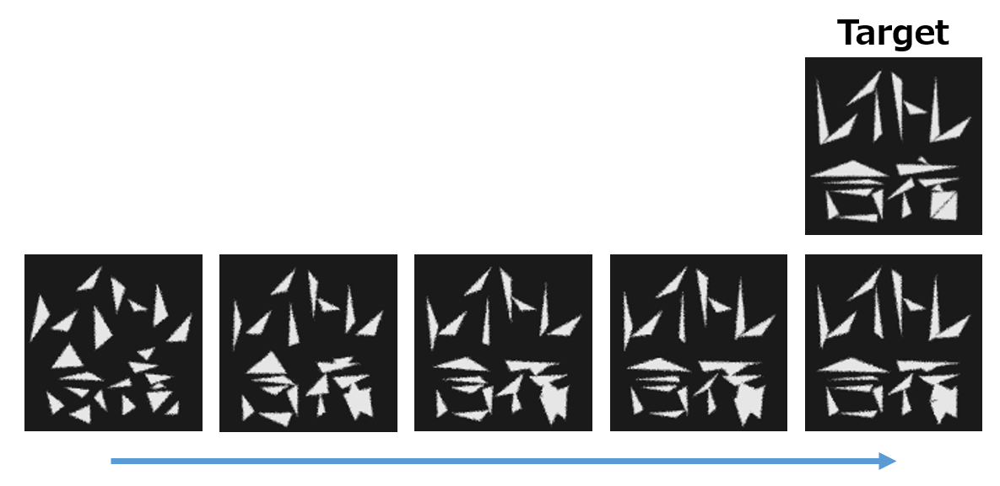

# レイトレ合宿9レンダラー MINGRAD

[レイトレ合宿9](https://sites.google.com/view/rtcamp9/home) 向けに制作したレンダラーです。
Windows 上での動作を想定しています。

合宿本戦時に使用したプレゼンスライドは右記です。 [presentation.pdf](presentation.pdf)

[Reparameterizing Discontinuous Integrands for Differentiable Rendering](https://rgl.epfl.ch/publications/Loubet2019Reparameterizing) をベースにして、微分可能レンダリングを最小構成で行っています。

## ビルドの準備
[PyTorch公式](https://pytorch.org/) から Win 用 CPU 版 LibTorch をダウンロードし、解凍したフォルダを third_party フォルダに libtorch という名前で置いてください。
